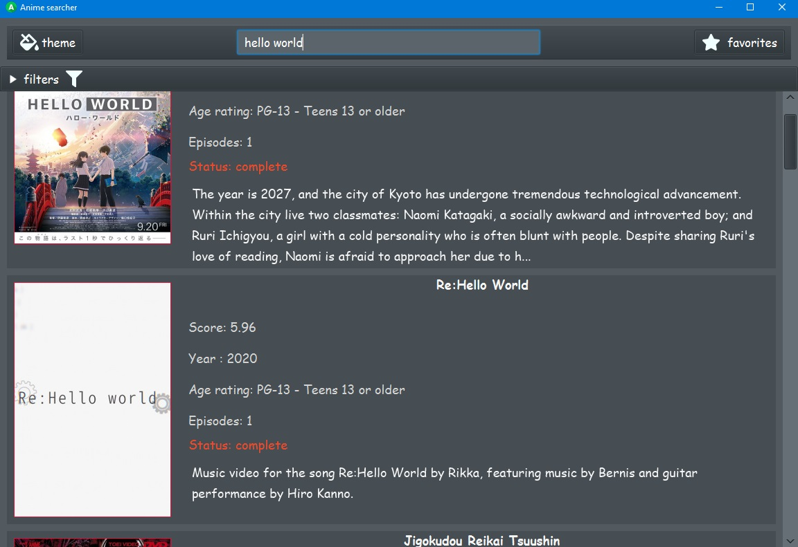
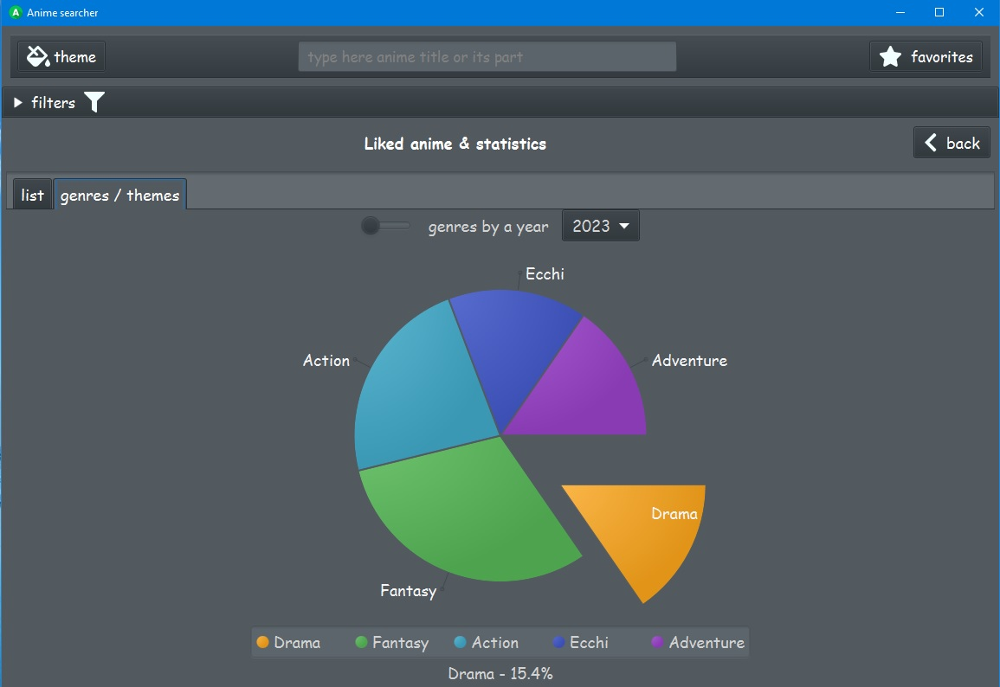
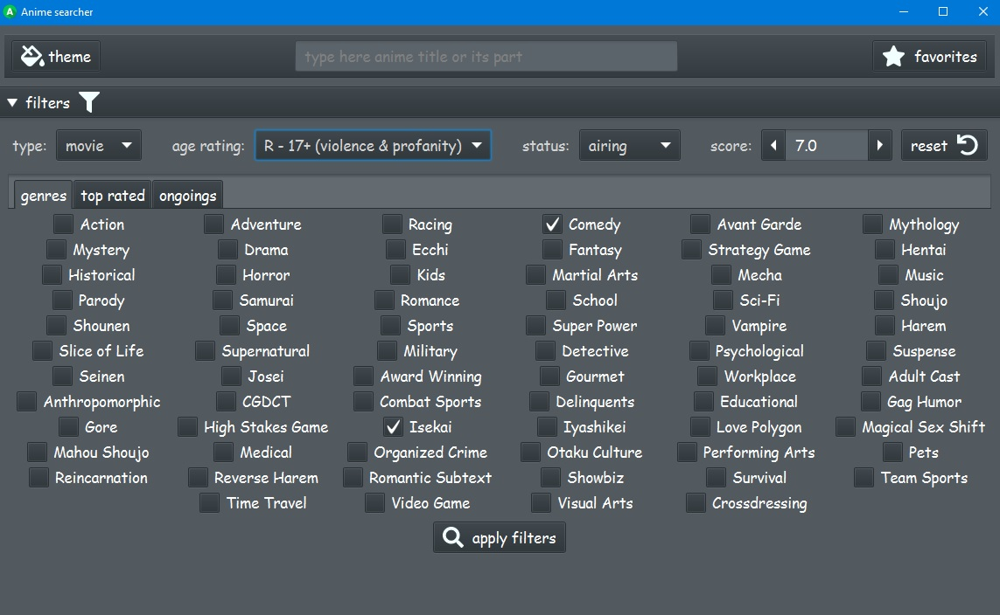

## It's a simple javafx app that applies various filters for anime searching.

### to build an executable for any other platform than windows, change these options of the jpackage task

```groovy
jpackage {
  installerType = 'msi'
  icon = 'src/main/resources/assets/icon.ico'
  installerOptions = ['--description', project.description, '--win-per-user-install',
  '--win-dir-chooser', '--win-shortcut']
}
```

#### *screenshots:*





